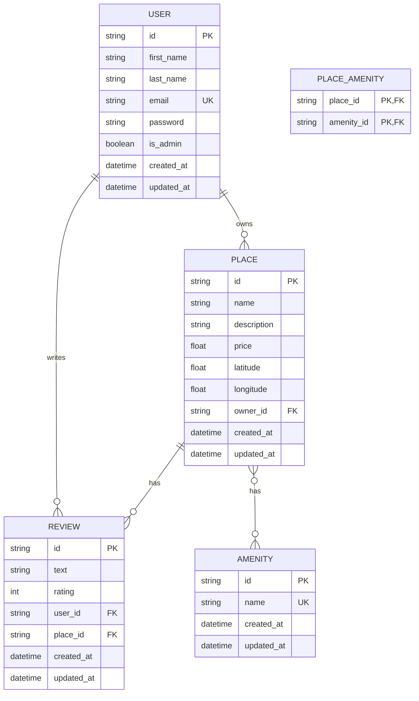

# HBnB Database ER Diagram

## Task 10: Generate Database Diagrams

This document contains the Entity-Relationship (ER) diagram for the HBnB project database schema, created using Mermaid.js.

## ER Diagram

## Relationships Explanation

1. **USER → PLACE (One-to-Many)**
   - A User can own many Places
   - A Place belongs to one User (via `owner_id` foreign key)
   - Relationship: `USER ||--o{ PLACE : "owns"`

2. **USER → REVIEW (One-to-Many)**
   - A User can write many Reviews
   - A Review is written by one User (via `user_id` foreign key)
   - Relationship: `USER ||--o{ REVIEW : "writes"`

3. **PLACE → REVIEW (One-to-Many)**
   - A Place can have many Reviews
   - A Review belongs to one Place (via `place_id` foreign key)
   - Relationship: `PLACE ||--o{ REVIEW : "has"`

4. **PLACE ↔ AMENITY (Many-to-Many)**
   - A Place can have many Amenities
   - An Amenity can be associated with many Places
   - Implemented through the `PLACE_AMENITY` association table
   - Relationship: `PLACE }o--o{ AMENITY : "has"`

## Entity Details

### USER
- **Primary Key**: `id` (string, UUID)
- **Unique**: `email`
- **Attributes**: first_name, last_name, email, password, is_admin, created_at, updated_at

### PLACE
- **Primary Key**: `id` (string, UUID)
- **Foreign Key**: `owner_id` → USER.id
- **Attributes**: name, description, price, latitude, longitude, owner_id, created_at, updated_at

### REVIEW
- **Primary Key**: `id` (string, UUID)
- **Foreign Keys**: 
  - `user_id` → USER.id
  - `place_id` → PLACE.id
- **Unique Constraint**: (user_id, place_id) - ensures one review per user per place
- **Attributes**: text, rating, user_id, place_id, created_at, updated_at

### AMENITY
- **Primary Key**: `id` (string, UUID)
- **Unique**: `name`
- **Attributes**: name, created_at, updated_at

### PLACE_AMENITY
- **Composite Primary Key**: (place_id, amenity_id)
- **Foreign Keys**:
  - `place_id` → PLACE.id
  - `amenity_id` → AMENITY.id
- **Purpose**: Association table for many-to-many relationship between Place and Amenity

## Notes

- All entities inherit `id`, `created_at`, and `updated_at` from BaseModelDB
- UUID format is used for all primary keys (CHAR(36) in SQL)
- Foreign key constraints ensure referential integrity
- The unique constraint on (user_id, place_id) in REVIEW prevents duplicate reviews
